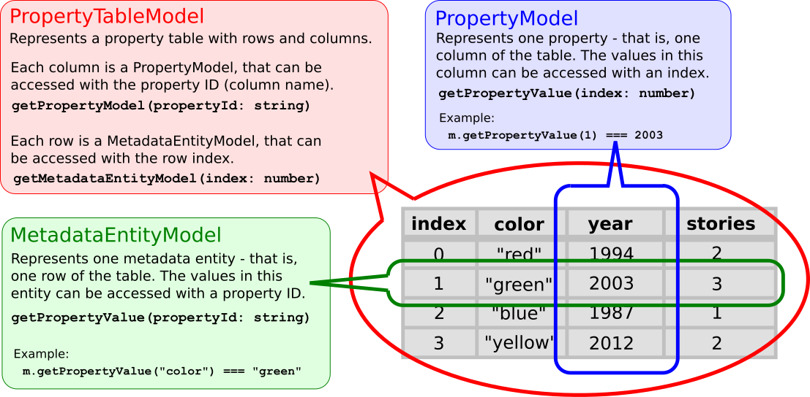

# 3D Tiles Tools Implementation Notes

Parts of the current implementation may still change. This page is only a short description of the overall structure.

## Directory structure:

- `./src`: The entry point for the command line interface is in `main.ts`

- `./src/base`: Generic, low-level utility functions.
  Most of the functions here are grouped into classes.
  - `Buffers`: Padding, detecting GZIPpedness, obtaining "magic" bytes...
  - `DataError`: An error indicating that input data was invalid on a low level (e.g. invalid binary data, or unparseable JSON)
  - `DeveloperError`: An error that was caused by the _developer_ (i.e. someone used the API in a wrong way)
  - `Iterables`: Iterating over files, filtering, mapping...
  - `Paths`: Resolving, checking/changing file extensions, ...
  - `Uris`: Detect data URIs or absolute URIs
  - Special cases: `defined` and `defaultValue`. These have some documentation explaining why they should rarely be used in TypeScript.

- `./src/contentProcessing`: Operations that are applied to tile content
  - `ContentOps`: Functions like `glbToB3dm`, _always_ operating on buffers: "Buffer in - Buffer out"
  - `GltfUtilites`/`GltfPipelineLegacy`: Wrappers around `gltf-pipeline` (e.g. for optimizing/upgrading the GLB in a B3DM)

- `./src/contentTypes`: Classes for determining the type of content data
  - `ContentData` as the main interface, implemented as `BufferedContentData` (to be created from a buffer that already exists in memory), or `LazyContentData` (that resolves "as little data as possible" to determine the content type)
  - `ContentDataTypes`: A set of strings representing different content data types, like `CONTENT_TYPE_B3DM` or `CONTENT_TYPE_TILESET`.
  - `ContentDataTypeRegistry`: Receives a `ContentData` object and returns one of the `ContentDataTypes` strings
  - `ContentDataTypeChecks`: Offers methods to create predicates that check for certain `included/excluded` content types

- `./src/implicitTiling/`: Classes that represent the structure and information of implicit tilesets
  - `AvailabilityInfo`: A simple interface for representing information about the availability of tiles, content, or child subtrees in implicit tiling. This is accessed with an _index_. Instances of classes implementing this interface can be created with the `AvailabilityInfos` class. 
  - `SubtreeInfo`: A structure that combines the `AvailabilityInfo` for tiles, content, and child subtrees (as it is defined in the input data). Instances of this structure can be created from a subtree JSON file or from binary subtree data, using the `SubtreeInfos` class.
  - `BinarySubtreeData`: A simple structure from which the `SubtreeInfo` is created. It combines the data that represents a 'subtree' in implicit tiling, in its 'raw' form: It contains the `Subtree` JSON object, as well as a `BinaryBufferStructure`/`BinaryBufferData` that was created from the `buffers/bufferViews` and the resolved binary data
  - `BinarySubtreeDataResolver`: A class that receives a `Subtree` JSON object, and returns the `BinarySubtreeData`, resolving all external `buffer.uri` references
  - `ImplicitTilingError`: An error indicating that implicit tiling data was structurally invalid
  - `ImplicitTilings`: Methods that try to hide the difference between `QUADTREE` and `OCTREE` tilings. They usually receive a `TileImplicitTiling` JSON object, and perform operations that _depend_ on the `subdivisionScheme`, but can be applied _agnostically_ of the subvision scheme. (Note: Some of this could be done in a cleaner and more generic way, involving ... generics (sic). This _does_ already exist (in a different language), but carrying type parameters along, as in `Availability<TreeCoordinates<Octree>>` can look obscure and "overengineered" at the first glance. I only hope that the current solution here does not turn out to be _underengineered_ ...)
  - `TemplateUris`: Internal method to substitute quadtree- or octree coordinates into template URIs
  
- `./src/io`: Classes for "loading data" in a very generic way, from different sources
  - `ResourceResolver` is the main interface, with the core functionality of receiving a URI and returning the data for that URI, with implementations to obtain that data e.g. from a file system or from a 3D Tiles Package.

- `./src/metadata/`: Classes for an implementation of the 3D Metadata Specification
  - Utilities for dealing with the JSON representations of metadata objects `ClassProperties`/`MetadataTypes`/`MetadataComponentTypes`...
  - Internal utilities for processing metadata values (e.g. normalization, `offset` and `scale` etc.), in `MetadataValues` and `ArrayValues`.
  - The `PropertyTableModel`, `MetadataEntityModel` and `PropertyModel` interfaces offer a very thin and simple abstraction layer for 3D Metadata. The structure of these classes is shown here:
  
  - Implementations of these interfaces exist:
    - For the JSON-based representation of metadata entities, metadata entity model instances can be created with `MetadataEntityModels`
    - `./src/metadata/binary` contains implementations of the metadata interfaces for _binary_ data, with `BinaryPropertyTableModel` being the top-level class, implementing the `PropertyTableModel` interface.

- `./src/packages`: Classes for reading or creating 3D Tiles Package files
  - These are implementations of the `TilesetSource` and `TilesetTarget` interface (see `./src/tilesetData`), based on 3TZ or 3DTILES

- `./src/pipelines`: **Preliminary** classes for modeling "processing pipelines" for tilesets
  - The `Pipeline` class describes the pipeline with its input and output, and contains one or more `TilesetStage` objects
  - The `TilesetStage` describes an operation that is applied to the tileset as a whole, usually focussing on modifications of the tileset JSON object. It may contain one or more `ContentStage` objects
  - The `ContentStage` is an operation that may be applied to tile content (i.e. "files") that are part of the tileset
  - Instances of these classes may be created with the `Pipelines`, `TilesetStages`, and `ContentStages` classes, respectively
  - A pipeline may be executed by a `PipelineExecutor`.

- `./src/spatial`: Basic classes for dealing with tree structures, specifically with quadtrees and octrees

- `./src/structure`: Plain old data objects for the elements of a Tileset JSON
  - E.g. `Tileset`, `Tile`, `Content`, ...
  - The goal is to have a _typed_ representation of a tileset JSON (assuming that the input JSON was indeed structurally valid - there are no validations or actual type checks during deserialization)

- `./src/tileFormats`: Classes for handling the (legacy) tile formats, B3DM, I3DM, PNTS and CMPT
  - `TileData` as a data structure for B3DM, I3DM, PNTS
  - `CompositeTileData` as a data structure for ... composite tile data (hence the name...)
  - `TileFormats`: Methods for handling tile data, mainly reading/writing tile data from/to buffers

- `./src/tilesetData`: Abstractions for the "files" that are "a tileset"
  - The goal is to have an abstraction that works for file systems as well as 3D Tiles packages (3TZ or 3DTILES)
  - The elements/etries are given as `key:string` which is the file name, and a `value:Buffer` which is the file contents
  - `TilesetSource` allows iterating over the entries
  - `TilesetTarget` allows collecting entries and writing them out

- `./src/tilesetProcessing`: Higher-level operations on tilesets
  - `TilesetCombiner`: Used to "inline" external tilesets into a single one
  - `TilesetMerger`: Used to create one tileset that refers to others as external tilesets
  - `TilesetUpgrader`: Upgrade a tileset to a newer version (many aspects unspecified here)
  - The (abstract) `TilesetProcessor` class and the (concrete) `BasicTilesetProcessor` class offer an infrastructure for generic operations on the tilesets and their content. These classes serve as the basis for the implementation of the pipeline execution functionality. 

- `./src/tilesets`: Utility functions for tileset operations
  - `Tiles` for traversing (explicit!) tile hierarchies
  - `Tilesets` offering convenience functions for `merge/combine/upgrade`
  - `Contents` with utility functions related to tile `content` objects
  - `Extensions` for handling extensions and extension declarations in tilesets (and glTF objects)

- `./src/traversal`: Classes for traversing tilesets
  - NOTE: The `SubtreeModel`/`SubtreeMetadataModel` interfaces _might_ at some point be moved into `implicitTiling`, but are currently tailored for the use in the traversal classes, and should be considered to be an "implementation detail" here.
  - The `TilesetTraverser` class is the entry point for the traversal. It allows traversing a tileset, and offer each traversed tile as a `TraversedTile` instance. The `TraversedTile` describes a tile during traversal (e.g. with a parent, and semantic-based overrides)

## Demos

The `./demos/` folder contains demos that show how to use various parts of the API. This is intended as an internal preview for developers. The functionality is not yet exposed as a public API.

Each of these demos can be started with

`npx ts-node ./demos/`_`<DemoName>`_`.ts`

### General tool functions

- `BinaryMetadataDemos`: Examples that show how to create and access `BinaryPropertyTableModel` instances with different types of properties.
- `ContentDataTypeChecksDemo`: Shows how to use `ContentDataTypeChecks` to check whether content data has a certain type
- `ContentDataTypeRegistryDemo`: Shows how to query the type of content data from the `ContentDataTypeRegistry`
- `MetadataDemos`: Examples that show how to work with `MetadataEntityModel` instances for accessing JSON-based metadata entities.
- `PackageConversion`: A command-line tool for converting from files/3TZ/3DTILES/ZIP to files/3TZ/3DTILES
- `PackagesDemo`: Show how to read/create/write 3D Tiles packages
- `PackageServer`: A **very** basic server that serves data from an arbitrary 3D Tiles package
  - To be used with the `PackageSandcastle`
- `Pipeline...`: **Preliminary** drafts for the `pipelines` functionalities
- `SpatialDemos`: Very basic examples showing how to use the quadree- and octree classes in `spatial`
- `SubtreeInfoDemos`: A demo that shows how to use the `SubtreeInfo` class to access (binary) subtree data
- `TileFormatsDemoBasic`: Basic usage demos for the `TileFormats` class
- `TileFormatsDemoConversions`: Demos showing how to use the `TileFormats` class for conversions (like extracting GLB from B3DM etc.)
- `TilesetProcessingDemos`: Demos for the `combine/merge/upgrade` functions
- `TilesetProcessorExamples`: Very basic demo of the `BasicTilesetProcessor` functions
- `TilesetUpgraderDemos`: More fine-grained demos for the upgrade functionality
- `TraversalDemo`: A basic example showing how to traverse a tileset
- `TraversalStatsDemo`: A basic example showing how to traverse a tileset and collect statistical information in the process.

The `./demos/benchmarks` folder contains very basic benchmarks for creating/reading different 3D Tiles package formats.

## API Definition

The API definition is tracked with https://api-extractor.com

After running `npm install`, the API documentation can be created with `npm run docs`. The API documentation will be written into the `build/docs` directory. The surface API information will be written into `etc/3d-tiles-tools.api.md`. This file captures the public API, and changes in the public API will cause a warning to be printed

> Warning: You have changed the public API signature for this project. Updating etc/3d-tiles-tools.api.md

This API definition file is tracked with Git, so changes in this file should be reviewed carefully.

## Release Process

- Prepare the actual release:
  - Update `CHANGES.md`
  - Update the version number in `package.json`

- Generate the tarball for the release:  
  
  `npm run package` 

  This will run the required scripts from the `package.json`:
    - Clean the build output folder
    - Prepare the package: 
      - Perform linting
      - Check formatting
      - Build (compile TypeScript to JavaScript)
      - Run the unit tests
      - Generate the documentation
      - Update the third-party information
    - Package the build output folder into a TAR file

- Verify the contents of the resulting TAR file. If there are unwanted files, add these files to `.npmignore` and re-generate the tarball

- Create a git tag for the version and push it:
 
  `git tag -a v1.2.3 -m "Release of version 1.2.3"`
  
  `git push origin v1.2.3`

- Publish the package:
  
  `npm publish`

### Build Scripts

The build scripts that are used for the release process are documented with `about:`_`<step>`_ in the `package.json` file. Each of these comments indicates the goal and preconditions for running the respective step. The structure of these scripts is often organized hierarchically:

- `docs`
  - `build`
  - `docs-generate`
    - `docs-prepare-directory`
    - `docs-extract-api`,
    - `docs-generate-markdown`,

 The intention is to make sure that each "top-level" (single-word) script can be executed without any preconditions (athough this pattern may not be applied for all steps). Intermediate steps can be executed manually or as part of other steps when it is ensured that the respective preconditions are met.

The following `devDependencies` are *only* used for the implementation of the build process:

- `mkdirp` - To generate the `etc` output directory for the API definition file (if it does not exist yet)
- `del-cli` - To delete the contents of the `build` output folder
- `copyfiles` - To copy the `bin/main` file to the build folder (see `bin/README.md` for details)

